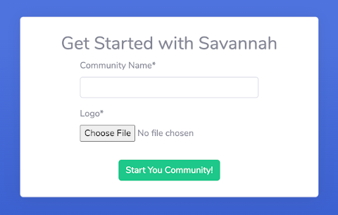
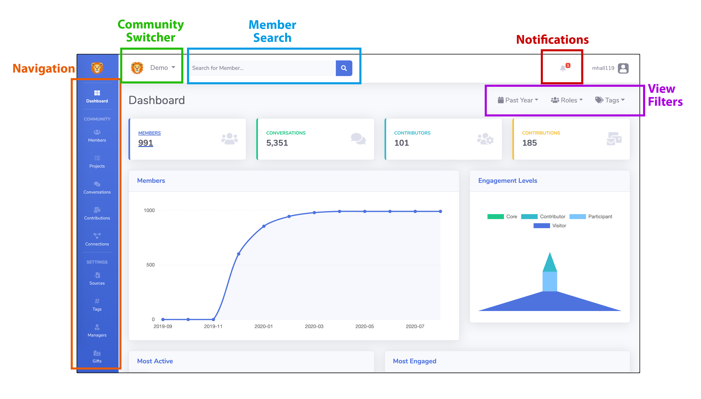

## Getting Started with Savannah

To start tracking your community with Savannah, you will need to [Create a new Community](https://savannahhq.com/community/new) by providing a name and logo.

Your Logo should be a square or roughly square image, at least 64x64 px in size.

### Adding Sources and Channels

Your first task after creating a new Communityis to add a data source and channels to it. You will see this message at the top of your screen until you've done that.

Click the `Sources` button in the prompt, or in the navigation bar on the left, to go to where you can add your first Source.

Click the `Add` button on the right hand side to see a list of sources you can import data from. Each option will prompt you for additional information specific to that source.

Once you've added a `Source`, you will be shown a list of available `Channels` from that source. These could be Slack channels, Github repos or Discourse categories, depending on your `Source` type. Savannnah will only import data from those channels that you choose to track in order to let you decide what data you're interested in tracking.

> Savannah imports data once every hour. It may take up to an hour before you begin to see data from your community.

## Navigating your new Community

### Filtering your view

### Notifications you will receive

### Sharing your Community with other Managers

## Managing your Community data

### Assigning Roles to your Members

### Creating your own Tags

### Using Projects